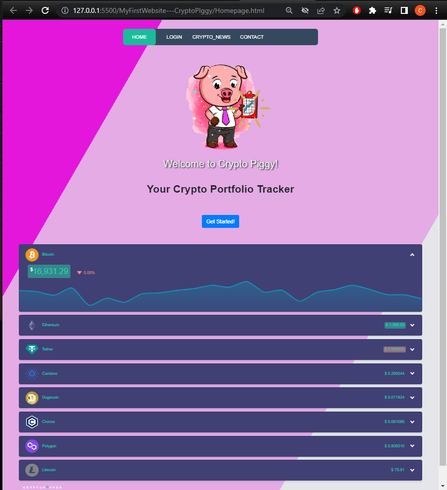
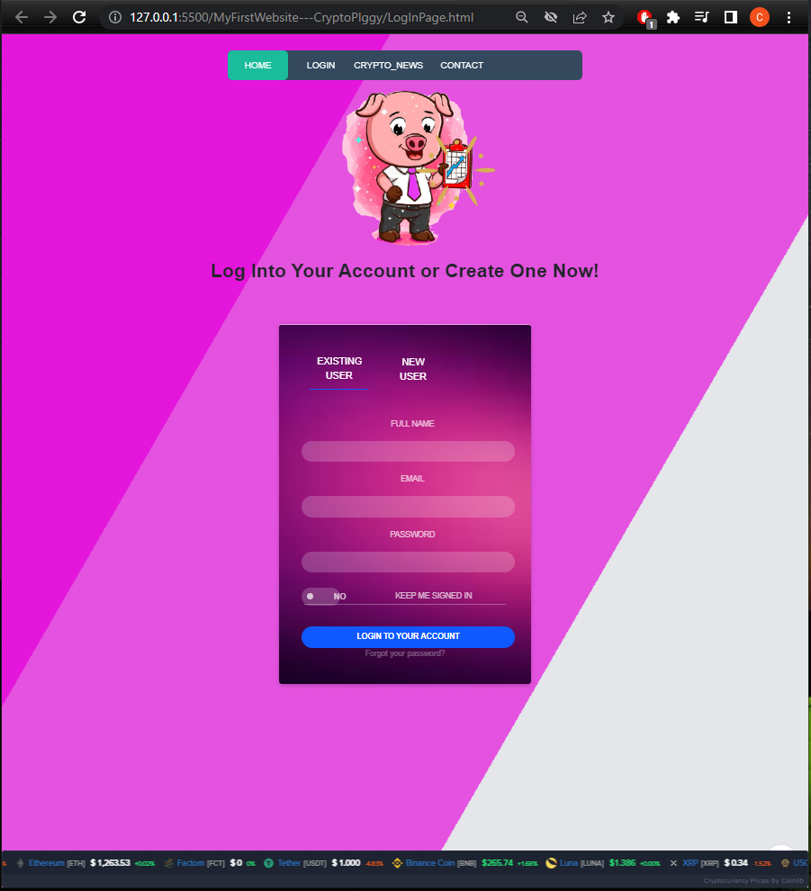
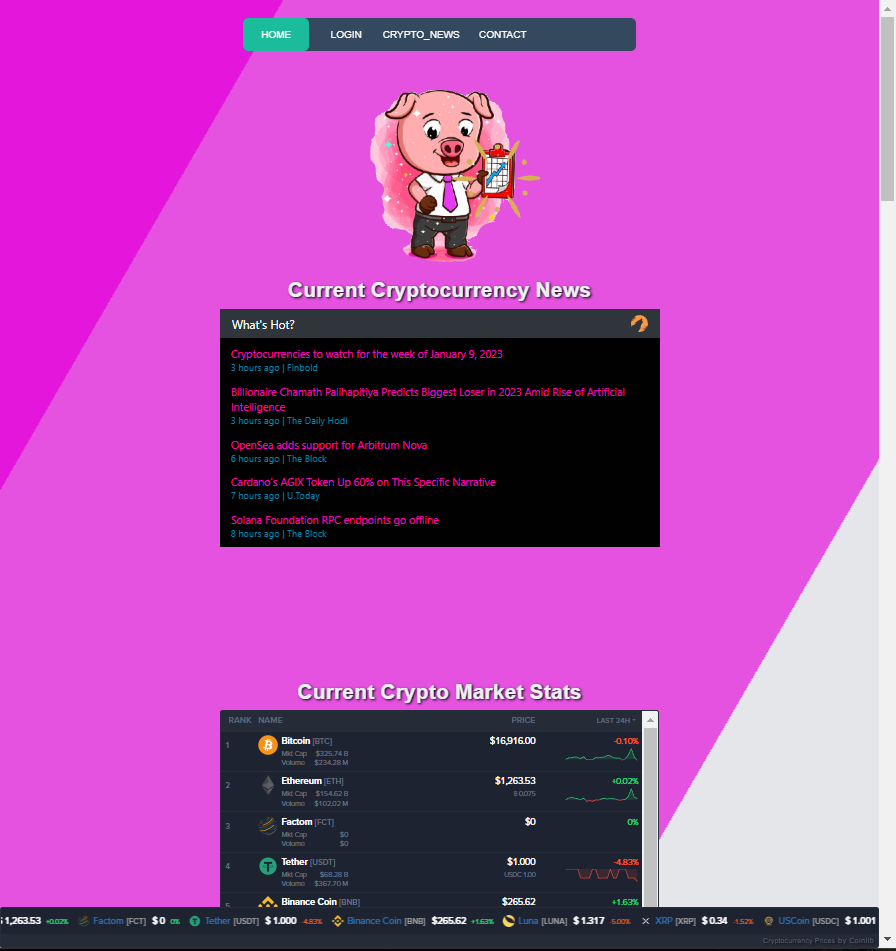

# MyFirstWebsite---CryptoPIggy

This project is my first fullstack website that I will be building with HTML, CSS & Bootstrap, JavaScript, and Python/Django for the backend database.
This will be a continuing work in progress over the next few weeks.

The website/application is a simple crypto currency asset tracker that will enable users to have a simple way of keeping track of crypto assets across various exchanges.

